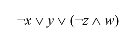
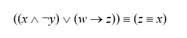
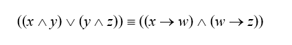
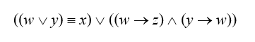

# Java решения заданий ЕГЭ

Объяснения лежат [здесь](https://ege.buran.rest)

Задания взяты с [сайта Константина Полякова](https://kpolyakov.spb.ru/school/ege.htm).

[С++ Исходники решений](https://github.com/aoklyunin/ege-cpp)

[Python Исходники решений](https://github.com/aoklyunin/ege-py)

## Задание 1

### Пример 1

(№ 4145) (Е. Джобс) На рисунке справа схема дорог Н-ского района изображена в виде графа, в
таблице содержатся сведения о длинах этих дорог (в километрах).
Так как таблицу и схему рисовали независимо друг от друга, то нумерация населённых пунктов
в таблице никак не связана с буквенными обозначениями на графе. В таблице в левом столбце
указаны номера пунктов, откуда совершается движение, в первой строке – куда. Определите
длину дороги между пунктами А и Б, если известно, что длина дороги между Г и Д меньше длины
дороги между Г и Е. Передвигаться можно только по указанным дорогам.


Ответ: 10

[Исходник](https://github.com/aoklyunin/ege-java/blob/master/src/main/java/problem1/Example1.java)

### Пример 2

Р-09. На рисунке справа схема дорог Н-ского района изображена в виде графа, в таблице
содержатся сведения о длинах этих дорог (в километрах). Так как таблицу и схему рисовали 
независимо друг от друга, то нумерация населённых пунктов в таблице никак не связана с
буквенными обозначениями на графе. Известно, что длина кратчайшего пути из пункта А в
пункт Ж не больше 15. Определите, какова длина кратчайшего пути из пункта Д в пункт В. 
В ответе запишите целое число – так, как оно указано в таблице.


Ответ: 19

[Исходник](https://github.com/aoklyunin/ege-java/blob/master/src/main/java/problem1/Example2.java)

### Пример 3


Р-10 (демо-2021). На рисунке справа схема дорог Н-ского района изображена в виде
графа, в таблице содержатся сведения о длинах этих дорог (в километрах).
Так как таблицу и схему рисовали независимо друг от друга, то нумерация населённых
пунктов в таблице никак не связана с буквенными обозначениями на графе. Определите,
какова протяжённость дороги из пункта Г в пункт Ж. В ответе запишите целое число –
так, как оно указано в таблице.


Ответ: 9

[Исходник](https://github.com/aoklyunin/ege-java/blob/master/src/main/java/problem1/Example3.java)

### Пример 4

На рисунке справа схема дорог Н-ского района изображена в виде графа, в таблице содержатся 
сведения о длинах этих дорог (в километрах). Так как таблицу и схему рисовали независимо 
друг от друга, то нумерация населённых пунктов в таблице никак не связана с буквенными 
обозначениями на графе. Определите, какова длина дороги из пункта В в пункт Е. 
В ответе запишите целое число – так, как оно указано в таблице.


Ответ: 20

[Исходник](https://github.com/aoklyunin/ege-java/blob/master/src/main/java/problem1/Example4.java)

### Пример 5

На рисунке справа схема дорог Н-ского района изображена в виде графа, в таблице содержатся
сведения о длинах этих дорог (в километрах). Так как таблицу и схему рисовали независимо друг
от друга, то нумерация населённых пунктов в таблице никак не связана с буквенными
обозначениями на графе. Определите, какова длина дороги из пункта А в пункт Д. В ответе
запишите целое число – так, как оно указано в таблице.


Ответ: 46

[Исходник](https://github.com/aoklyunin/ege-java/blob/master/src/main/java/problem1/Example5.java)

### Пример 6

Между населёнными пунктами A, B, C, D, E, F построены дороги, протяжённость которых приведена
в таблице. (Отсутствие числа в таблице означает, что прямой дороги между пунктами нет.)
Определите длину кратчайшего пути между пунктами A и F, проходящего через пункт E и не 
проходящего через пункт B. Передвигаться можно только по указанным дорогам.


Ответ: 17

[Исходник](https://github.com/aoklyunin/ege-java/blob/master/src/main/java/problem1/Example6.java)

### Пример 7

Между населёнными пунктами A, B, C, D, E, F, Z построены дороги с односторонним движением. 
В таблице указана протяжённость каждой дороги. Отсутствие числа в таблице означает, 
что прямой дороги между пунктами нет. Например, из A в B есть дорога длиной 4 км, а из
B в A дороги нет.

Сколько существует таких маршрутов из A в Z, которые проходят через 6 и более населен-ных
пунктов? Пункты A и Z при подсчете учитывать. Два раза проходить через один пункт нельзя.


Ответ: 6

[Исходник](https://github.com/aoklyunin/ege-java/blob/master/src/main/java/problem1/Example7.java)

### Пример 8

Р-04. Между населёнными пунктами A, B, C, D, E, F, G построены дороги, протяжённость 
которых приведена в таблице. (Отсутствие числа в таблице означает, что прямой дороги между
пунктами нет.)

Определите длину кратчайшего пути между пунктами A и G (при условии, что
передвигаться можно только по построенным дорогам).


Ответ: 23

[Исходник](https://github.com/aoklyunin/ege-java/blob/master/src/main/java/problem1/Example8.java)

### Пример 9

Р-03. Между населёнными пунктами A, B, C, D, E, F построены дороги, протяжённость которых
приведена в таблице. (Отсутствие числа в таблице означает, что прямой дороги между
пунктами нет.)

Определите длину кратчайшего пути между пунктами A и F (при условии, что передвигаться 
можно только по построенным дорогам).


Ответ: 9

[Исходник](https://github.com/aoklyunin/ege-java/blob/master/src/main/java/problem1/Example9.java)

[Задания для самостоятельного выполнения](problems/problem1/exercises.pdf)

## Задание 2

### Пример 1

Логическая функция F задаётся выражением



На рисунке
приведён фрагмент таблицы истинности функции F, содержащий все наборы аргументов,
при которых функция F ложна. Определите, какому столбцу таблицы истинности функции
F соответствует каждая из переменных x, y, z, w.

В ответе напишите буквы x, y, z, w в том порядке, в котором идут соответствующие им
столбцы. Буквы в ответе пишите подряд, никаких разделителей между буквами ставить не нужно.

<table>
    <tbody>
    <tr>
        <td>?</td>
        <td>?</td>
        <td>?</td>
        <td>?</td>
        <td>F</td>
    </tr>
    <tr>
        <td>0</td>
        <td>0</td>
        <td>0</td>
        <td>1</td>
        <td>0</td>
    </tr>
    <tr>
        <td>0</td>
        <td>1</td>
        <td>0</td>
        <td>1</td>
        <td>0</td>
    </tr>
    <tr>
        <td>0</td>
        <td>1</td>
        <td>1</td>
        <td>1</td>
        <td>0</td>
    </tr>
    </tbody>
</table>

**Ответ:** x y z w


[Исходник](https://github.com/aoklyunin/ege-java/blob/master/src/main/java/problem2/Example1.java)


### Пример 2


Логическая функция F задаётся выражением


На рисунке приведён частично заполненный фрагмент таблицы истинности функции F, содержащий
неповторяющиеся строки. Определите, какому столбцу таблицы истинности функции F соответствует
каждая из переменных x, y, z, w.

<table>
    <tbody>
    <tr>
        <td>?</td>
        <td>?</td>
        <td>?</td>
        <td>?</td>
        <td>F</td>
    </tr>
    <tr>
        <td>1</td>
        <td></td>
        <td>1</td>
        <td></td>
        <td>1</td>
    </tr>
    <tr>
        <td>0</td>
        <td>1</td>
        <td></td>
        <td>0</td>
        <td>1</td>
    </tr>
    <tr>
        <td></td>
        <td>1</td>
        <td>1</td>
        <td>0</td>
        <td>1</td>
    </tr>
    </tbody>
</table>

В ответе напишите буквы x, y, z, w в том порядке, в котором идут соответствующие им столбцы.
Буквы в ответе пишите подряд, никаких разделителей между буквами ставить не нужно.

**Ответ:** z y x w

[Исходник](https://github.com/aoklyunin/ege-java/blob/master/src/main/java/problem2/Example2.java)


### Пример 3


Логическая функция F задаётся выражением



На рисунке приведён частично заполненный фрагмент таблицы истинности функции F, содержащий
неповторяющиеся строки. Определите, какому столбцу таблицы истинности функции F соответствует
каждая из переменных x, y, z, w.

<table>
    <tbody>
    <tr>
        <td>?</td>
        <td>?</td>
        <td>?</td>
        <td>?</td>
        <td>F</td>
    </tr>
    <tr>
        <td></td>
        <td>0</td>
        <td>0</td>
        <td>1</td>
        <td>1</td>
    </tr>
    <tr>
        <td>1</td>
        <td>1</td>
        <td>0</td>
        <td>0</td>
        <td>1</td>
    </tr>
    <tr>
        <td>0</td>
        <td></td>
        <td></td>
        <td>1</td>
        <td>1</td>
    </tr>
    </tbody>
</table>

В ответе напишите буквы x, y, z, w в том порядке, в котором идут соответствующие им столбцы.
Буквы в ответе пишите подряд, никаких разделителей между буквами ставить не нужно.

**Ответ:** z y w x

[Исходник](https://github.com/aoklyunin/ege-java/blob/master/src/main/java/problem2/Example3.java)


### Пример 4


Логическая функция F задаётся выражением



На рисунке приведён частично заполненный фрагмент таблицы истинности функции F, содержащий
неповторяющиеся строки. Определите, какому столбцу таблицы истинности функции F соответствует
каждая из переменных x, y, z, w.

<table>
    <tbody>
    <tr>
        <td>?</td>
        <td>?</td>
        <td>?</td>
        <td>?</td>
        <td>F</td>
    </tr>
    <tr>
        <td>0</td>
        <td>1</td>
        <td>1</td>
        <td>1</td>
        <td>1</td>
    </tr>
    <tr>
        <td>0</td>
        <td>1</td>
        <td>0</td>
        <td></td>
        <td>1</td>
    </tr>
    <tr>
        <td>0</td>
        <td>1</td>
        <td>0</td>
        <td></td>
        <td>1</td>
    </tr>
    </tbody>
</table>

В ответе напишите буквы x, y, z, w в том порядке, в котором идут соответствующие им столбцы.
Буквы в ответе пишите подряд, никаких разделителей между буквами ставить не нужно.


**Ответ:** x w z y

[Исходник](https://github.com/aoklyunin/ege-java/blob/master/src/main/java/problem2/Example4.java)


### Пример 5


Логическая функция F задаётся выражением



На рисунке приведён частично заполненный фрагмент таблицы истинности функции F, содержащий
неповторяющиеся строки. Определите, какому столбцу таблицы истинности функции F соответствует
каждая из переменных x, y, z, w.

<table>
    <tbody>
    <tr>
        <td>?</td>
        <td>?</td>
        <td>?</td>
        <td>?</td>
        <td>F</td>
    </tr>
    <tr>
        <td>1</td>
        <td></td>
        <td></td>
        <td>1</td>
        <td>0</td>
    </tr>
    <tr>
        <td></td>
        <td></td>
        <td></td>
        <td>1</td>
        <td>0</td>
    </tr>
    <tr>
        <td>1</td>
        <td></td>
        <td>1</td>
        <td></td>
        <td>1</td>
    </tr>
    </tbody>
</table>

В ответе напишите буквы x, y, z, w в том порядке, в котором идут соответствующие им столбцы.
Буквы в ответе пишите подряд, никаких разделителей между буквами ставить не нужно.

**Ответ:** y x z w

[Исходник](https://github.com/aoklyunin/ege-java/blob/master/src/main/java/problem2/Example5.java)

[Задания для самостоятельного выполнения](problems/problem2/exercises.pdf)


## Задание 5

### Пример 1
Автомат обрабатывает натуральное число N по следующему алгоритму:
1. Строится двоичная запись числа N.
2. Удаляются первая слева единица и все следующие непосредственно за
   ней нули. Если после этого в числе не остаётся цифр, результат этого
   действия считается равным нулю.
3. Полученное число переводится в десятичную запись.
4. Новое число вычитается из исходного, полученная разность выводится на экран.


Пример: дано число N = 11. Алгоритм работает следующим образом:
1. Двоичная запись числа N: 1011.
2. Удаляется первая единица и следующий за ней ноль: 11.
3. Десятичное значение полученного числа 3.
4. На экран выводится число 11 – 3 = 8.

Сколько разных значений будет показано на экране автомата при последовательном вводе
всех натуральных чисел от 500 до 5000?

**Ответ: 256, 512, 1024, 2048, 4096**

[Исходник](https://github.com/aoklyunin/ege-java/blob/master/src/main/java/problem5/Example4.java)

### Пример 2

Учитель предлагает детям три цифры. Ученики должны сначала найти сумму
первой и второй цифр, потом – сумму второй и третьей цифр.
Затем полученные числа записываются друг за другом в порядке невозрастания
(правое число меньше или равно левому).

Пример. Исходные цифры: 6, 3, 9. Суммы: 6 + 3 = 9; 3 + 9 = 12.

Результат: 129.
Укажите, какая из следующих последовательностей символов может быть получена в результате.

1) 1915

2) 1815

3) 188

4) 1518

**Ответ: 2**

[Исходник](https://github.com/aoklyunin/ege-java/blob/master/src/main/java/problem5/Example5.java)


### Пример 3

Автомат получает на вход четырёхзначное натуральное число и строит новое число по следующему алгоритму:

1) вычисляются суммы первой и второй, второй и третьей и третьей и четвёртой цифр;

2) из полученных сумм отбрасывается наименьшая;

3) остальные записываются в порядке неубывания.

Пример: исходное число: 1284. Суммы: 1 + 2 = 3; 2 + 8 = 10; 8 + 4 = 12. Отбрасывается
наименьшая сумма 3. Результат: 1012. Укажите наименьшее и наибольшее число, при вводе
которого автомат выдаёт значение 511.


**Ответ: максимальное число равно 9232, минимальное - 1056*

[Исходник](https://github.com/aoklyunin/ege-java/blob/master/src/main/java/problem5/Example6.java)


### Пример 4


Автомат получает на вход два двузначных шестнадцатеричных числа. В этих
числах все цифры не превосходят цифру 6 (если в числе есть цифра больше 6, автомат отказывается работать). По этим числам строится новое
шестнадцатеричное число по следующим правилам.
1. Вычисляются два шестнадцатеричных числа – сумма старших разрядов полученных чисел и сумма младших разрядов этих чисел.
2. Полученные два шестнадцатеричных числа записываются друг за другом в порядке возрастания (без разделителей).

Пример. Исходные числа: 66, 43. Поразрядные суммы: A, 9. Результат: 9A.

Определите, какое из следующих чисел может быть результатом работы автомата.

1) 9F

2) 911

3) 42

4) 7A

[Исходник](https://github.com/aoklyunin/ege-java/blob/master/src/main/java/problem5/Example7.java)


[Задания для самостоятельного выполнения](problems/problem5/exercises.pdf)


## Задание 8

### Пример 1

Игорь составляет таблицу кодовых слов для передачи сообщений, каждому
сообщению соответствует своё кодовое слово.

В качестве кодовых слов Игорь использует
трёхбуквенные слова, в которых могут быть только буквы Ш, К, О, Л, А, причём буква К
появляется ровно 1 раз. Каждая из других допустимых букв может встречаться в кодовом слове
любое количество раз или не встречаться совсем.

Сколько различных кодовых слов может использовать
Игорь?

**Ответ: 48**


[Исходник](https://github.com/aoklyunin/ege-java/blob/master/src/main/java/problem8/Example1.java)


### Пример 2

Маша составляет шестибуквенные слова перестановкой букв слова КАПКАН. При этом она избегает слов с двумя
подряд одинаковыми буквами. Сколько различных кодов может составить Маша?


**Ответ: 84**

[Исходник](https://github.com/aoklyunin/ege-java/blob/master/src/main/java/problem8/Example2.java)


### Пример 3

Маша составляет 5-буквенные коды из букв В, У, А, Л, Ь. Каждую букву нужно использовать
ровно 1 раз, при этом буква Ь не может стоять на первом месте и перед гласной.
Сколько различных кодов может составить Маша?

**Ответ: 60**

[Исходник](https://github.com/aoklyunin/ege-java/blob/master/src/main/java/problem8/Example3.java)

### Пример 4

Все 4-буквенные слова, составленные из букв К, Л, Р, Т, записаны в алфавитном порядке и пронумерованы. Вот начало списка:

2. КККК
3. КККЛ
4. КККР
5. КККТ

   ...

Запишите слово, которое стоит на 67-м месте от начала списка.

**Ответ: ЛККР**

[Исходник](https://github.com/aoklyunin/ege-java/blob/master/src/main/java/problem8/Example4.java)


[Задания для самостоятельного выполнения](problems/problem8/exercises.pdf)

## Задание 12

### Пример 1
Редактор получает на вход строку цифр и преобразовывает её. Редактор может выполнять две команды,
в обеих командах `v` и `w` обозначают цепочки цифр.

```
заменить (v, w)
```

Эта команда заменяет в строке первое слева вхождение цепочки `v` на цепочку `w`. Если цепочки
`v` в строке нет, эта команда не изменяет строку.

```
нашлось (v)
```

Эта команда проверяет, встречается ли цепочка v в строке исполнителя Редактор. Если она
встречается, то команда возвращает логическое значение «истина», в противном случае
возвращает значение «ложь». Строка при этом не изменяется.

Дана программа для исполнителя Редактор:
```
    НАЧАЛО
    ПОКА нашлось (2222) ИЛИ нашлось (8888)
        ЕСЛИ нашлось (2222)
        ТО заменить (2222, 88)
        ИНАЧЕ заменить (8888, 22)
        КОНЕЦ ЕСЛИ
    КОНЕЦ ПОКА
    КОНЕЦ
```

Какая строка получится в результате применения приведённой программы к строке, состоящей из
70 идущих подряд цифр 8? В ответе запишите полученную строку.

**Ответ: 22**

[Исходник](https://github.com/aoklyunin/ege-java/blob/master/src/main/java/problem12/Example1.java)

### Пример 2

В приведенном ниже фрагменте алгоритма, записанном на алгоритмическом языке, переменные a, b, c
имеют тип «строка», а переменные i, k – тип «целое». Используются следующие функции:

`Длина(a)` – возвращает количество символов в строке a. (Тип «целое»)
`Извлечь(a,i)` – возвращает i-тый (слева) символ в строке a. (Тип «строка»)
`Склеить(a,b)` – возвращает строку, в которой записаны сначала все символы

строки a, а затем все символы строки b. (Тип «строка»)

Значения строк записываются в одинарных кавычках (Например, a:='дом'). Фрагмент алгоритма:
```
i := Длина(a)
k := 2
b := 'А'
пока i > 0
    нц
    c := Извлечь(a,i)
    b := Склеить(b,c)
    i := i – k
    кц
b := Склеить(b,'Т')
```
Какое значение будет у переменной b после выполнения вышеприведенного фрагмента алгоритма,
если значение переменной a было ‘ПОЕЗД’?

1) ‘АДЕПТ’

2) ‘АДЗЕОП’

3) ‘АДТЕТПТ’

4) ‘АДЕОТ’


**Ответ: 1)**

[Исходник](https://github.com/aoklyunin/ege-java/blob/master/src/main/java/problem12/Example2.java)


[Задания для самостоятельного выполнения](problems/problem12/exercises.pdf)


## Задание 14

### Пример 1

Значение арифметического выражения: 49^7 + 7^{21} – 7 – записали в системе
счисления с основанием 7. Сколько цифр $6$ содержится в этой записи?

**Ответ: 13.**

[Исходник](https://github.com/aoklyunin/ege-java/blob/master/src/main/java/problem14/Example1.java)


### Пример 2

Сколько значащих нулей в двоичной записи числа

4^{512} + 8^{512} – 2^{128} – 250

**Ответ: 519.**

[Исходник](https://github.com/aoklyunin/ege-java/blob/master/src/main/java/problem14/Example2.java)


### Пример 3

Запись числа 381_{10} в системе счисления с основанием N оканчивается на 3 и содержит 3 цифры.
Укажите наибольшее возможное основание этой системы счисления N.

**Ответ: 18.**

[Исходник](https://github.com/aoklyunin/ege-java/blob/master/src/main/java/problem14/Example3.java)


[Задания для самостоятельного выполнения](problems/problem14/exercises.pdf)


## Задание 15

### Пример 1

Обозначим через ДЕЛ(n,m) утверждение «натуральное число n делится без
остатка на натуральное число m». Для какого наибольшего натурального числа А формула

\lnot ДЕЛ(x,А)\Rightarrow (ДЕЛ(x,6)\Rightarrow \lnot ДЕЛ(x,9))

тождественно истинна (то есть принимает значение 1 при любом натуральном значении
переменной х)?


**Ответ: 18.**

[Исходник](https://github.com/aoklyunin/ege-java/blob/master/src/main/java/problem15/Example1.java)


### Пример 2

Укажите наименьшее целое значение А, при котором выражение

(5k + 6n \gt 57) \lor ((k \leq A) \land (n \lt A))

истинно для любых целых положительных значений k и n.

**Ответ: 10.**

[Исходник](https://github.com/aoklyunin/ege-java/blob/master/src/main/java/problem15/Example2.java)

### Пример 3

На числовой прямой даны отрезки $A = [70; 90]$, $B = [40; 60]$ и $C =[0; N]$ и функция

$$
F(x) = (\lnot (x \in A) \Rightarrow  (x \in B) ) \land (\lnot (x \in C) \Rightarrow  (x \in A) )
$$

При каком наименьшем числе N функция F(x) истинна более чем для 30 целых чисел x?


**Ответ: 49.**

[Исходник](https://github.com/aoklyunin/ege-java/blob/master/src/main/java/problem15/Example3.java)

### Пример 4

Введём выражение $M \& K$, обозначающее поразрядную конъюнкцию $M$ и $K$ (логическое «И»
между соответствующими битами двоичной записи). Определите наименьшее натуральное
число a, такое что выражение

( x  \& 125 \ne 1) \lor  ((x \& 34 = 2) \rightarrow (x \& a = 0))

тождественно истинно (то есть принимает значение 1 при любом натуральном значении переменной x)?


**Ответ: 4.**

[Исходник](https://github.com/aoklyunin/ege-java/blob/master/src/main/java/problem15/Example4.java)


[Задания для самостоятельного выполнения](problems/problem15/exercises.pdf)


## Задание 16

### Пример 1


Алгоритм вычисления функции F(n) задан следующими соотношениями:

F(n) = 1 при n = 1

F(n) = n + 2 + F(n–1), если n чётно,

F(n) =  2* F(n–2), если n нечётно.

Чему равно значение функции F(24)? Для выполнения задания можно также написать
программу или воспользоваться редактором электронных таблиц.


**Ответ: 2074.**

[Исходник](https://github.com/aoklyunin/ege-java/blob/master/src/main/java/problem16/Example1.java)


### Пример 2


Определите, сколько символов * выведет эта процедура при вызове F(22):

```
void F( int n )
{
  print('*');
  if( n >= 1 ) {
    print('*');
    F(n-1);
    F(n-2);
    F(n-3);
  }
}
```

Для выполнения задания можно также написать программу или воспользоваться редактором
электронных таблиц.

**Ответ: 1957585.**

[Исходник](https://github.com/aoklyunin/ege-java/blob/master/src/main/java/problem16/Example2.java)


[Задания для самостоятельного выполнения](problems/problem16/exercises.pdf)


